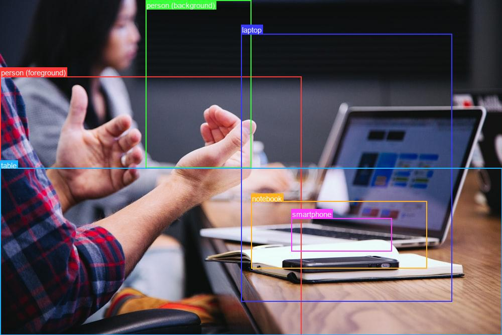

<div align="center">


**Gemini object detection in one import. Point it at an image, get back labeled bounding boxes.**

[](https://github.com/ztanruan/Prompt2Box/actions/workflows/ci.yml)
[](https://www.python.org/)
[](./LICENSE)
[](https://ai.google.dev/)

</div>

---

## Contents

- [What it is](#what-it-is) · [How it works](#how-it-works) · [Get started](#get-started)
- [Authentication](#authentication) · [The API](#the-api) · [Models](#models) · [CLI](#cli)
- [Output format](#output-format) · [Integrations](#integrations)
- [Limitations](#limitations) · [Troubleshooting](#troubleshooting) · [Development](#development)

## What it is

Prompt2Box turns any local image into structured detections using Google's
**Gemini** vision models — no training, no weights, no GPU. You give it a file
path; it returns a list of items, each with a **label** and a **pixel-space
bounding box**.

<p align="center">
  
  <br>
  <em>Real output of <code>prompt2box desk.jpg</code> — 6 items (laptop, smartphone, notebook, table, 2 people) with boxes + labels drawn on a copy.</em>
</p>

Use it three ways:

- **Library** — `detect("photo.jpg")` inline in any Python app.
- **CLI** — `prompt2box photo.jpg` for a quick JSON dump + annotated image.
- **Reusable client** — `Detector(...)` when you call it in a loop.

## How it works

Gemini's spatial mode returns boxes as `[ymin, xmin, ymax, xmax]` normalized to
a 0–1000 grid. Prompt2Box asks for exactly that via a JSON `response_schema` (so
the output is structurally guaranteed), then maps the numbers back to your
image's real pixels and hands you ergonomic objects.

```
image path ──► Gemini (spatial mode) ──► 0-1000 boxes ──► pixel boxes ──► DetectionResult
                                                                          ├─ .objects  (list[Detection])
                                                                          ├─ .save_annotated("out.jpg")
                                                                          └─ .to_json()
```

## Get started

Not on PyPI yet — install from source:

```bash
git clone https://github.com/ztanruan/Prompt2Box && cd Prompt2Box
pip install -e .                       # or: pip install "git+https://github.com/ztanruan/Prompt2Box"
export GEMINI_API_KEY="AIza..."        # https://aistudio.google.com/apikey  (see Authentication)
```

```python
from prompt2box import detect

result = detect("photo.jpg")
print(result.labels)                   # ['cat', 'sofa', 'lamp']

for d in result:
    print(d.label, d.box)              # 'cat' (412, 233, 588, 401)

result.save_annotated("photo_boxed.jpg")
```

Or from the shell:

```bash
prompt2box photo.jpg                   # prints JSON, writes photo_boxed.jpg
```

## Authentication

Prompt2Box supports two backends:

**1. Developer API (default)** — a Gemini API key:

```bash
export GEMINI_API_KEY="AIzaSy..."
prompt2box photo.jpg
```

The CLI also reads a `.env` file in the current directory (real environment
variables take precedence), so you can `cp .env.example .env` and fill in your
key instead of exporting it.

> ⚠️ **`AQ.`-prefixed keys don't work.** Google is migrating from `AIza…`
> keys to `AQ.…` "auth keys", and as of mid-2026 the `AQ.` keys are rejected
> by the Developer API with `401 ACCESS_TOKEN_TYPE_UNSUPPORTED`. If AI Studio
> only gives you `AQ.` keys, either create an `AIza…` key in the
> [Google Cloud Console](https://console.cloud.google.com/) (enable the
> *Generative Language API* → Credentials → API key), or use Vertex AI below.

**2. Vertex AI** — no API key; uses your Google Cloud login:

```bash
gcloud auth application-default login          # one time
export GOOGLE_CLOUD_PROJECT="your-project-id"
prompt2box photo.jpg --vertex                  # or --project your-project-id
```

```python
from prompt2box import detect
result = detect("photo.jpg", vertexai=True, project="your-project-id")
```

## The API

### One-shot

```python
from prompt2box import detect

result = detect(
    "photo.jpg",
    api_key=None,            # falls back to GEMINI_API_KEY / GOOGLE_API_KEY
    model="gemini-2.5-flash",
    prompt=None,             # free-form: "only the people in the foreground"
    classes=None,            # restrict to labels: ["cat", "dog"]
)
```

### Reusable client (build once, call many times)

```python
from prompt2box import Detector

# Detector holds a client; close it when done (or use it as a context manager).
with Detector(model="gemini-2.5-flash") as det:
    for path in image_paths:
        result = det.detect(path, classes=["car", "truck", "bus"])
        print(path, result.labels)

# Or manage the lifecycle yourself:
det = Detector()
try:
    det.detect("photo.jpg")
finally:
    det.close()
```

(The one-shot `detect()` helper closes its client automatically.)

### Batch (concurrent)

```python
det = Detector()
results = det.detect_batch(["a.jpg", "b.jpg", "c.jpg"], max_workers=4)
# results is aligned to the input list; a failed image is None, others still run
for r in results:
    if r is not None:
        print(r.labels)
```

### `DetectionResult` — list-like, batteries included

```python
result = detect("street.jpg")

len(result)                            # number of items
result.labels                          # ['car', 'car', 'pedestrian']
result[0]                              # first Detection
result.filter("car")                   # new result with only car-ish labels
result.to_json()                       # JSON string
result.to_dict()                       # {"image", "width", "height", "objects": [...]}
result.save_annotated("out.jpg")       # draw boxes + labels to a file
result.annotated_image()               # → PIL.Image (draw in-memory)
```

### `Detection` — one item

```python
d = result[0]
d.label                                # "car"
d.box                                  # (x_min, y_min, x_max, y_max)  ← Pillow crop order
d.x_min, d.y_min, d.x_max, d.y_max     # individual pixel coords
d.width, d.height, d.area, d.center    # derived geometry
d.box_normalized                       # Gemini [ymin, xmin, ymax, xmax] 0-1000 (ordered)
d.crop("photo.jpg", "car_only.jpg")    # save just this box as a new image
d.to_dict()
```

### Refining — clean up the model's rough output

LLM detections have predictable junk: a box that's basically the whole frame,
the same object returned twice, tiny specks. `refine()` removes these
deterministically (no extra API call) and tells you **why** each was dropped.

```python
result = detect("scene.jpg")
clean = result.refine()                # defaults: drop whole-image + duplicate boxes
clean.labels                           # ['sky', 'sun', 'sea', 'palm trees', ...]
clean.dropped                          # [(Detection(label='background', ...), 'covers 98% of image')]

# Tune it, or run it inline during detection:
from prompt2box import RefineConfig
detect("scene.jpg", refine=True)                                  # defaults
detect("scene.jpg", refine=RefineConfig(max_area_frac=0.6,        # stricter whole-image cutoff
                                        min_area_frac=0.001,       # also drop specks
                                        drop_labels=("background", "watermark")))
```

## Models

Set the model with `model=` (library) or `-m` (CLI). Any Gemini model with
vision + spatial support works:

| Model | When |
| --- | --- |
| `gemini-2.5-flash` *(default)* | Fast and cheap; good for most detection. |
| `gemini-2.5-pro` | Slower/pricier, but better on cluttered scenes and fine labels. |

```bash
prompt2box photo.jpg -m gemini-2.5-pro
```

## CLI

```bash
prompt2box IMAGE [options]
```

| Flag | Description |
| --- | --- |
| `image` | Path to a local image file (positional) |
| `-o, --output` | Where to save the annotated image (default `<image>_boxed.<ext>`) |
| `--no-image` | Don't draw/save an annotated image |
| `-j, --json-out` | Also write detections JSON to this path |
| `-m, --model` | Gemini model id (default `gemini-2.5-flash`) |
| `-p, --prompt` | Free-form instruction to constrain detection |
| `-c, --classes` | Restrict to labels, e.g. `-c cat dog` |
| `--api-key` | API key (overrides `GEMINI_API_KEY` / `GOOGLE_API_KEY`) |
| `--vertex` | Use Vertex AI instead of an API key (auth via `gcloud`) |
| `--project` | GCP project id for `--vertex` (or `GOOGLE_CLOUD_PROJECT`) |
| `--location` | Vertex AI location for `--vertex` (default `global`) |
| `--max-size` | Downscale images larger than this (longest edge, px) before upload (default `1536`) |
| `-v, --verbose` | Verbose logging to stderr |

Large photos are automatically downscaled before upload to cut cost/latency —
boxes are normalized, so this doesn't affect accuracy (coords map back to the
full-resolution image). Pass `--max-size 0` to disable.

**HEIC/HEIF** (iPhone photos) needs an optional extra:

```bash
pip install "prompt2box[heic]"     # adds pillow-heif
```

JSON goes to **stdout**; status lines go to **stderr**, so you can pipe cleanly:

```bash
prompt2box photo.jpg --no-image | jq '.[].label'
```

## Output format

The CLI prints a JSON array to stdout — one object per detection (real output
for the desk photo above, truncated to 2 of the 6 items):

```json
[
  {
    "label": "laptop",
    "x_min": 480, "y_min": 67, "x_max": 900, "y_max": 600,
    "box_normalized": [100, 480, 900, 900]
  },
  {
    "label": "smartphone",
    "x_min": 580, "y_min": 434, "x_max": 780, "y_max": 500,
    "box_normalized": [650, 580, 750, 780]
  }
]
```

- `label` — short open-vocabulary name the model chose for the item.
- `x_min, y_min, x_max, y_max` — absolute pixels, origin top-left.
- `box_normalized` — Gemini's raw `[ymin, xmin, ymax, xmax]` on the 0–1000 scale,
  kept so you can re-map to any image size yourself.

## Integrations

Prompt2Box returns plain pixel boxes, so it drops into the rest of the CV
ecosystem with a couple of lines.

**Batch a folder** — `detect_batch` runs the calls in parallel:

```python
from pathlib import Path
from prompt2box import Detector

det = Detector()                                   # one client, reused
images = sorted(Path("images").glob("*.jpg"))
results = det.detect_batch(images, max_workers=4)  # list aligned to `images`

for img, result in zip(images, results):
    if result is None:                             # that image failed; others still ran
        continue
    result.save_annotated(f"out/{img.stem}_boxed.jpg")
    print(img.name, "->", result.labels)
```

**OpenCV** — draw the boxes yourself:

```python
import cv2
from prompt2box import detect

frame = cv2.imread("photo.jpg")
for d in detect("photo.jpg"):
    cv2.rectangle(frame, (d.x_min, d.y_min), (d.x_max, d.y_max), (0, 255, 0), 2)
    cv2.putText(frame, d.label, (d.x_min, d.y_min - 6),
                cv2.FONT_HERSHEY_SIMPLEX, 0.6, (0, 255, 0), 2)
cv2.imwrite("photo_cv.jpg", frame)
```

**supervision** — hand boxes to Roboflow's annotators/trackers:

```python
import numpy as np
import supervision as sv
from prompt2box import detect

result = detect("photo.jpg")
detections = sv.Detections(xyxy=np.array([d.box for d in result]))
labels = result.labels
```

**Crop every detection to its own file** (e.g. to build a dataset):

```python
result = detect("shelf.jpg")
for i, d in enumerate(result):
    d.crop("shelf.jpg", f"crops/{d.label}_{i}.jpg")
```

**Shell pipeline** — JSON on stdout, pipe into `jq`:

```bash
prompt2box photo.jpg --no-image | jq -r '.[].label' | sort | uniq -c
```

## Limitations

Prompt2Box is an **LLM-based** detector. That brings real tradeoffs you should
weigh before depending on it:

- **Boxes are approximate.** Gemini estimates coordinates; they're often a bit
  loose and won't be pixel-accurate — e.g. on
  [this dog photo](docs/example.jpg) the box swallows most of the lower frame. It
  is **not** a replacement for a trained detector like YOLO/Detectron when you
  need tight, precise boxes.
- **Non-deterministic.** The same image can yield slightly different boxes or
  labels across runs, even at `temperature=0`.
- **Cost & latency.** Each call is a billed API request and typically takes a few
  seconds — unsuitable for real-time or high-volume pipelines.
- **No real confidence scores.** Gemini rarely returns per-box confidence, so we
  don't expose one.

**Where it shines:** zero setup, open-vocabulary labels (detect "the rusty
bicycle", not a fixed class list), and quick prototyping/one-off analysis. If you
need precision, speed, or scale, use a dedicated detection model.

**Want to measure it yourself?** There's an IoU eval harness in
[`eval/`](./eval) — point it at a manifest of images + ground-truth boxes and it
reports precision / recall / mean-IoU. Build a manifest from a COCO slice to get
a real number for your use case.

## Troubleshooting

| Symptom | Cause & fix |
| --- | --- |
| `401 ACCESS_TOKEN_TYPE_UNSUPPORTED` | Your key is an AI Studio **`AQ.`** auth key, which the Developer API currently rejects. Use an `AIza…` key, or switch to `--vertex`. |
| `no API key found` | Set `GEMINI_API_KEY` (or pass `--api-key`), or use `--vertex`. |
| `403 ... requires billing to be enabled` (Vertex) | Enable billing on the project, then retry after ~1–2 min. |
| `404 ... model not found` for a location | Some models aren't in every region — try `--location us-central1`. |
| `needs the optional 'pillow-heif' package` | You passed a `.heic/.heif` image — `pip install "prompt2box[heic]"`. |
| Empty/garbled result | Rare model formatting miss; rerun, or try `-m gemini-2.5-pro`. |
| Boxes look loose/wrong | Expected — see [Limitations](#limitations). Try `-m gemini-2.5-pro` or a tighter `--prompt`. |

## What's inside

| Module | Responsibility |
| --- | --- |
| `prompt2box/detector.py` | `Detector`, `detect()`, `Detection`, `DetectionResult`; Gemini call, robust JSON parsing, 0-1000 → pixel conversion, image downscaling, typed-error retry |
| `prompt2box/refine.py` | `RefineConfig`, `refine_detections()`, shared `box_iou`; drop whole-image/duplicate boxes |
| `prompt2box/draw.py` | Render/save annotated images (Pillow) |
| `prompt2box/cli.py` | `prompt2box` command (+ `.env` loading) |

## Requirements

- Python 3.10+
- A Gemini API key (`GEMINI_API_KEY`) — free tier works. Get one at
  <https://aistudio.google.com/apikey>.

## Development

```bash
pip install -e ".[dev]"
pre-commit install          # optional: auto-lint/format on every commit
pytest                      # run the test suite (no key or network needed)
ruff check . && ruff format --check .   # lint + format
mypy                        # type check
```

The tests inject a fake client via `Detector(client=...)`, so they exercise
parsing, the 0-1000 → pixel conversion, retry/backoff, result helpers, cropping,
refinement, and annotation without any API calls. A real-API smoke test in
`tests/test_integration.py` runs only when credentials are present. CI runs
ruff (lint + format), mypy, and pytest on Python 3.10–3.13.
Runnable examples live in [`examples/`](./examples).

Releases publish to PyPI automatically when a `vX.Y.Z` tag is pushed (see
[`.github/workflows/release.yml`](./.github/workflows/release.yml)).

## Security

Never commit or paste your API key. `.env` is git-ignored; prefer environment
variables. If a key leaks, revoke it at
<https://aistudio.google.com/apikey>. Vertex AI (`--vertex`) avoids long-lived
keys entirely by using your `gcloud` login.

## Contributing

Issues and PRs welcome — see [CONTRIBUTING.md](./CONTRIBUTING.md). Keep changes
small and tested; the suite must stay offline.

## Acknowledgements

Built on the [`google-genai`](https://github.com/googleapis/python-genai) SDK and
[Pillow](https://python-pillow.org/). Uses Gemini's
[spatial understanding](https://ai.google.dev/gemini-api/docs/image-understanding)
capability for the underlying detection.

## License

Apache 2.0 — see [LICENSE](./LICENSE). © Jin Tan Ruan.
