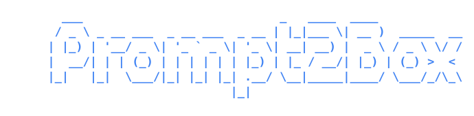
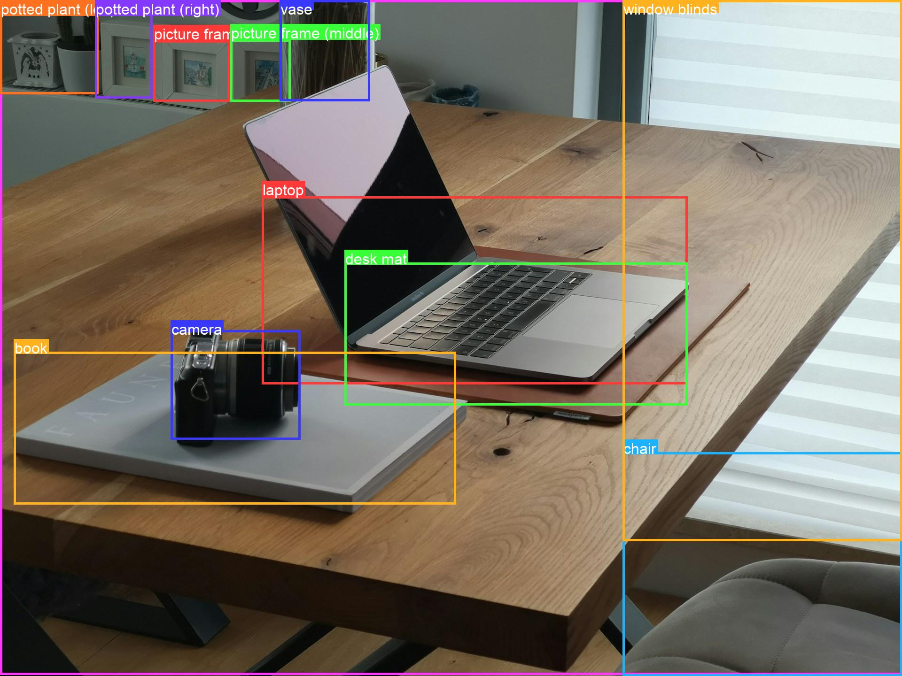

<div align="center">



**Object detection without a model. Point it at an image, get back labeled bounding boxes - powered by Gemini.**

[](https://github.com/ztanruan/Prompt2Box/actions/workflows/ci.yml)
[](https://www.python.org/)
[](./LICENSE)
[](https://ai.google.dev/)

<br>



<sub>One call. No training, no weights, no GPU - just a file path and an API key.</sub>

</div>

---

No dataset. No fine-tuning. No `pip install torch`. You give Prompt2Box a local
image; it asks Gemini's spatial model what's in it and hands you back a clean
list of items, each with a **label** and a **pixel-space bounding box** - ready
to draw, crop, or feed into the rest of your pipeline.

```python
from prompt2box import detect

result = detect("desk.jpg")
result.labels                 # ['laptop', 'camera', 'book', 'vase', 'chair', ...]
result.save_annotated("out.jpg")
```

## Install

Not on PyPI yet - install from source:

```bash
git clone https://github.com/ztanruan/Prompt2Box && cd Prompt2Box
pip install -e .
```

You need a Gemini API key - get one at [aistudio.google.com/apikey](https://aistudio.google.com/apikey):

```bash
export GEMINI_API_KEY="AIza..."     # or drop it in a .env file
prompt2box desk.jpg
```

> **Heads up:** if AI Studio only hands you an `AQ.`-prefixed key, it won't work
> with the Developer API yet (Google is mid-migration). Either create an `AIza…`
> key in the [Cloud Console](https://console.cloud.google.com/), or use Vertex AI
> (see [Authentication](#authentication) below).

## Use it three ways

**Library - one call:**

```python
from prompt2box import detect

result = detect("desk.jpg")
for d in result:
    print(d.label, d.box)          # 'laptop' (560, 420, 1480, 820)
```

**Library - reusable client (close it, or use `with`):**

```python
from prompt2box import Detector

with Detector(model="gemini-2.5-flash") as det:
    for path in images:
        print(det.detect(path, classes=["car", "truck", "bus"]).labels)

    results = det.detect_batch(images, max_workers=4)   # concurrent
```

**CLI:**

```bash
prompt2box desk.jpg                       # JSON to stdout + desk_boxed.jpg
prompt2box desk.jpg -c laptop camera book # only these labels
prompt2box desk.jpg -p "only the plants"  # free-form instruction
prompt2box desk.jpg --refine              # drop whole-image / duplicate boxes
prompt2box desk.jpg --no-image | jq -r '.[].label'
```

## How it works

Gemini's spatial mode returns boxes as `[ymin, xmin, ymax, xmax]` on a 0-1000
grid. Prompt2Box requests exactly that via a JSON `response_schema` (so the
output is structurally guaranteed), maps the numbers back to your image's real
pixels, and wraps them in ergonomic objects.

```
image ──► Gemini (response_schema) ──► 0-1000 boxes ──► pixel boxes ──► DetectionResult
                                                                        ├─ .objects        list[Detection]
                                                                        ├─ .refine()        drop junk boxes
                                                                        ├─ .save_annotated() draw + save
                                                                        └─ .to_json()
```

## Results

A `DetectionResult` is a list of `Detection`s with batteries included:

```python
result = detect("street.jpg")

len(result)                            # how many items
result.labels                          # ['car', 'car', 'pedestrian']
result[0]                              # first Detection
result[:3]                             # a sub-result (still list-like)
result.filter("car")                   # only car-ish labels
result.refine()                        # drop whole-image catch-alls + duplicates
result.to_json()                       # JSON string
result.save_annotated("out.jpg")       # boxes + labels on a copy
result.annotated_image()               # → PIL.Image (in-memory)
```

```python
d = result[0]
d.label                                # "car"
d.box                                  # (x_min, y_min, x_max, y_max)  ← Pillow crop order
d.width, d.height, d.area, d.center    # derived geometry
d.crop("street.jpg", "car.jpg")        # save just this box
```

### Refining

LLM detections have predictable junk - a box that's basically the whole frame,
the same object returned twice, tiny specks. `refine()` removes them
deterministically (no extra API call) and tells you **why** each was dropped:

```python
clean = detect("scene.jpg").refine()
clean.dropped     # [(Detection(label='background', ...), 'covers 98% of image')]

from prompt2box import RefineConfig
detect("scene.jpg", refine=RefineConfig(max_area_frac=0.6, drop_labels=("watermark",)))
```

## Authentication

| Backend | How | Notes |
| --- | --- | --- |
| **Developer API** (default) | `export GEMINI_API_KEY="AIza..."` | Free tier. `.env` in the working dir is read automatically. `AQ.` keys don't work yet. |
| **Vertex AI** | `prompt2box img.jpg --vertex` | No API key - uses your `gcloud` login. Needs a billing-enabled GCP project. |

```bash
# Vertex AI (one-time)
gcloud auth application-default login
export GOOGLE_CLOUD_PROJECT="your-project-id"
prompt2box desk.jpg --vertex
```

```python
detect("desk.jpg", vertexai=True, project="your-project-id")
```

## CLI reference

```
prompt2box IMAGE [options]
```

| Flag | Description |
| --- | --- |
| `-o, --output` | Annotated image path (default `<image>_boxed.<ext>`; unsupported formats → `.png`) |
| `--no-image` | Don't write an annotated image |
| `-j, --json-out` | Also write detections JSON to a file |
| `-m, --model` | Gemini model id (default `gemini-2.5-flash`; try `gemini-2.5-pro` for hard scenes) |
| `-p, --prompt` | Free-form instruction |
| `-c, --classes` | Restrict to labels, e.g. `-c cat dog` |
| `--refine` | Drop whole-image and duplicate boxes |
| `--max-size` | Downscale longest edge before upload (default `1536`) |
| `--vertex` / `--project` / `--location` | Use Vertex AI |
| `--api-key` | Override `GEMINI_API_KEY` |
| `-v, --verbose` | Verbose logging to stderr |

JSON goes to **stdout**, status lines to **stderr** - pipe cleanly.

## Output format

```json
[
  { "label": "laptop", "x_min": 560, "y_min": 420, "x_max": 1480, "y_max": 820,
    "box_normalized": [292, 292, 569, 771] },
  { "label": "camera", "x_min": 360, "y_min": 660, "x_max": 640, "y_max": 920,
    "box_normalized": [458, 188, 639, 333] }
]
```

- `x_min, y_min, x_max, y_max` - absolute pixels, origin top-left.
- `box_normalized` - Gemini's ordered `[ymin, xmin, ymax, xmax]` on the 0-1000 scale.

## Limitations

Prompt2Box is an **LLM detector**, with the tradeoffs that implies:

- **Boxes are approximate** and won't be pixel-tight - this is not a YOLO/Detectron replacement.
- **Non-deterministic** - the same image can give slightly different boxes run to run.
- **Cost & latency** - each call is billed and takes a few seconds; not for real-time or high volume.

Where it shines: **zero setup**, **open-vocabulary** labels (detect "the rusty
bicycle", not a fixed class list), and quick prototyping. Need precision or
speed? Use a trained detector. Want to measure it yourself? There's an IoU
harness in [`eval/`](./eval).

## FAQ

**Why are some boxes loose or huge?**
That's the LLM being approximate. Run `--refine` to drop whole-image catch-alls
and duplicates, or try `-m gemini-2.5-pro` on cluttered scenes.

**My API key starts with `AQ.` and gives a 401.**
Google is migrating key formats and `AQ.` keys aren't accepted by the Developer
API yet. Use an `AIza…` key (Cloud Console) or `--vertex`.

**`--vertex` fails with `No module named 'OpenSSL'`.**
Your environment enforces certificate-based access (context-aware access / mTLS),
which makes `google-auth` reach for `pyOpenSSL`. Install the optional auth extra:
`pip install pyopenssl`. It's not a Prompt2Box dependency - only some enterprise
networks need it.

**Does it run offline?**
No - it calls Gemini. The *test suite* runs fully offline (the client is faked).

**Which model should I use? Can I use Claude / Llama / other models?**
Any **Gemini** vision model works — `gemini-2.5-flash` (default) is fast and
cheap, `gemini-2.5-pro` is more accurate on busy images, and newer Gemini
versions work too. Set it with `-m` or `model=`.
Non-Gemini models (Claude, Llama, Mistral on Vertex) are **not supported for
detection**: the normalized `box_2d` output is a Gemini-trained capability, so
other models don't return usable boxes. Pass one and you'll get a warning.

**Is it on PyPI?**
Not yet - install from source (above).

## Development

```bash
pip install -e ".[dev]"
pre-commit install          # optional
pytest                      # 71 tests, no key or network needed
ruff check . && ruff format --check .
mypy
```

The suite injects a fake client, so it's fully offline. A real-API smoke test in
`tests/test_integration.py` runs only when credentials are present. CI runs ruff,
mypy, and pytest on Python 3.10-3.13. Runnable examples live in
[`examples/`](./examples).

## License

MIT - see [LICENSE](./LICENSE). Demo images derive from
[Unsplash](https://unsplash.com/license); see [docs/CREDITS.md](./docs/CREDITS.md).
